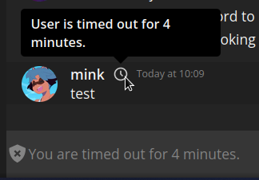

# 20220903-1: Changes to role colours, masquerades, members and user timeouts

Role colours now support most valid CSS gradients and colours up to 128 characters and which satisfy the following Regex:

```regex
(?i)^(?:[a-z ]+|var\(--[a-z\d-]+\)|rgba?\([\d, ]+\)|#[a-f0-9]+|(repeating-)?(linear|conic|radial)-gradient\(([a-z ]+|var\(--[a-z\d-]+\)|rgba?\([\d, ]+\)|#[a-f0-9]+|\d+deg)([ ]+(\d{1,3}%|0))?(,[ ]*([a-z ]+|var\(--[a-z\d-]+\)|rgba?\([\d, ]+\)|#[a-f0-9]+)([ ]+(\d{1,3}%|0))?)+\))$
```

You can now also masquerade role colours per-message, simply include the `colour` property matching the properties above.

All members now include a `joined_at` property which indicate when the timestamp at which they joined a certain server.

All members now also have a `timeout` property which can be changed by `PATCH /servers/<server_id>/members/<user_id>`, users will not be able to interact with the server until the time expires. A visual indicator will also display on the user's end as well as for others in chat:


