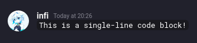
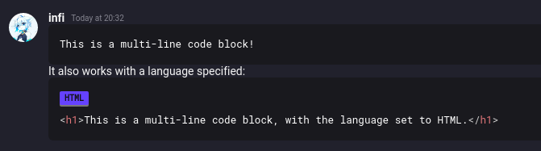
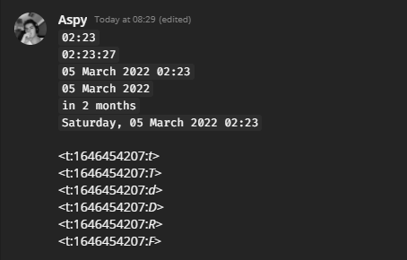

# Markdown Reference  
  
Revolt uses a simple, plain-text based, and super easy text formatting system called **Markdown**.  
Use it to **make your text *stand out!***  
  
## Basic Styles  
  
| Style             | Markdown                                             |
|-------------------|------------------------------------------------------|
| **bold**          | \*\*bold\*\* or \_\_bold\_\_                         |
| *italics*         | \*italics\* or \_italics\_                           |
| **bold italics**  | \*\*\*bold italics\*\*\* or \_\_\_bold italics\_\_\_ |
| ~~strikethrough~~ | \~\~strikethrough\~\~                                |

## Code Blocks  
  
You can use code blocks for text that needs to be easily copied, such as code.  
  
### Single-line Code Block

| Style                               | Markdown                              |
|-------------------------------------|---------------------------------------|
| `This is a single-line code block!` | \`This is a single-line code block!\` |

:::note This is how it looks on Revolt:


  
:::

### Multi-line Code Block

:::note Style

```
This is a multi-line code block!
```

```js
let x = "This is a multi-line code block, with the language set to JS"
```

:::

:::note Markdown

\`\`\`  
This is a multi-line code block!  
\`\`\`

\`\`\`js  
let x = "This is a multi-line code block, with the language set to JS"  
\`\`\`

:::


:::note This is how it looks on Revolt:

  
  
:::

:::tip

The language display, shown above as a purple button, also acts as a copy button -
if you click on it, the entire contents of the code block get pasted into your clipboard!
__This is especially useful for code blocks that contain a lot of text.__  

:::
  
## Block Quotes

You can use Block Quotes to signify a quote. The block quote can be multiple levels deep.

:::note Style

> > If you change the way you look at things, the things you look at change.  
>
> — Wayne Dyer   

trash can sus

:::

:::note Markdown

\> \> If you change the way you look at things, the things you look at change.  
\>  
\> — Wayne Dyer   

trash can sus

:::

:::warning

Three Block Quotes on a single line will *not* quote the whole message - it will make the first line a triple-quote.

:::

:::tip

You need to put an empty line after every Block Quote to signify the end of the Block Quote.

:::

## Superscript and Subscript

You can make a portion of text appear higher up or higher down with superscript and subscript.

| Style          | Markdown |
|----------------|----------|
| H<sub>2</sub>O | H~2~0    |
| CO<sup>2</sup> | CO^2^    |

## Spoilers

You can hide spoilers using spoiler tags.  
  
Simply __wrap your spoiler in two exclamation marks before and after__, and the text will only be revealed after an additional click.

:::note Example

The impostor is !!jan!!

:::

## Links  
  
You can embed links in regular text.

| Style                                | Markdown                                  |
|--------------------------------------|-------------------------------------------|
| [Revolt](https://revolt.chat)        | \[Revolt\]\(https://revolt\.chat\)        |

## Headings

You can add headings to your messages. The lower the heading number, the larger the text. The smallest heading is 6.

:::note Style

# Heading 1
## Heading 2
### Heading 3
#### Heading 4
<!-- Workaround for Docusaurus making Heading 5 uppercase -->
<h5 style={{textTransform: "unset"}}>Heading 5</h5>

###### Heading 6

:::

:::note Markdown

\# Heading 1  
\#\# Heading 2  
\#\#\# Heading 3  
\#\#\#\# Heading 4  
\#\#\#\#\# Heading 5  
\#\#\#\#\#\# Heading 6

:::

## Tables

You can create tables in your messages.

:::note Style

| Header 1 | Header 2 | Header 3 |
|:---------|:---------|:---------|
| Cell 1   | Cell 2   | Cell 3   |
| Cell 4   | Cell 5   | Cell 6   |
| Cell 7   | Cell 8   | Cell 9   |
    
:::

:::note Markdown

```
| Header 1 | Header 2 | Header 3 |
|----------|----------|----------|
| Cell 1   | Cell 2   | Cell 3   |
| Cell 4   | Cell 5   | Cell 6   |
| Cell 7   | Cell 8   | Cell 9   |
```

:::

## Lists

You can create lists in your messages, such as unordered lists (`*`, `+`, `-`) and ordered lists (`1.`, `2.`, `3.`).

:::note Style

* Item 1
* Item 2
* Item 3

1. Item 1
2. Item 2
3. Item 3

:::

:::note Markdown

\* Item 1  
\* Item 2  
\* Item 3  
  
1\. Item 1  
2\. Item 2  
3\. Item 3  

:::

## KaTeX

You can use KaTeX to render math and some other advanced markup in your messages.

| Style                          | Markdown                         |
|--------------------------------|----------------------------------|
| $x^2$                          | \$x^2\$                          |
| $\sin(x)$                      | \$\sin(x)\$                      |
| $\frac{x}{y}$                  | \$\frac{x}{y}\$                  |
| $\sqrt{x^2}$                   | \$\sqrt{x^2}\$                   |
| $\sum_{i=1}^n a_i$             | \$\sum_{i=1}^n a_i\$             |
| $\lim_{x \to \infty}$          | \$\lim_{x \to \infty}\$          |
| $\color{red}\textsf{Red Text}$ | \$\color{red}\textsf{Red Text}\$ |

See [KaTeX's documentation](https://katex.org/docs/supported.html) for more information.

## Timestamps

You can display timestamps in your messages. The format requires you to get the time as a Unix timestamp. You can do this with online services like [unixtimestamp.com](https://www.unixtimestamp.com/).



| Style                               | Markdown           |
|-------------------------------------|--------------------|
| `01:37`                             | <t:1663846662:t> |
| `01:37:42`                          | <t:1663846662:T> |
| `22 September 2022`                 | <t:1663846662:D> |
| `22 September 2022 01:37`           | <t:1663846662:f> |
| `Thursday, 22 September 2022 01:37` | <t:1663846662:F> |
| `in 9 months` (f.e.)                | <t:1663846662:R> |

## Emoji

You can use emoji in your messages. This allows you to express yourself in a more human way.

| Style                                                          | Markdown                                |
|----------------------------------------------------------------|-----------------------------------------|
|  | :cowboy_hat_face<!---->:                |
|  | :flushed<!---->:                        |
|  | :heart_eyes<!---->:                     |
|  | :smiling_face_with_three_hearts<!---->: |

You can see the full list of emoji shortcodes using auto-completion - simply start typing with a `:`.

You can see the full list of custom global emojis [here](https://dl.insrt.uk/projects/revolt/).
